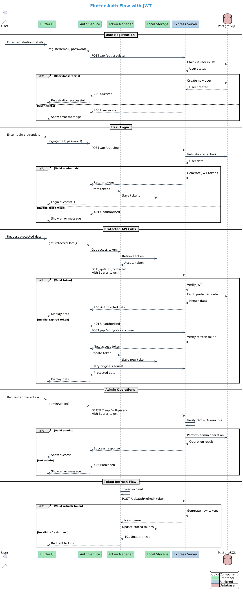

# Flutter OAuth2 Full-Stack Application

A full-stack application demonstrating OAuth2 authentication using Flutter for the frontend and Node.js with Express for the backend.

## 🏗️ Architecture Overview

### Frontend (Flutter)

- Written in Dart using Flutter framework
- Runs on the host machine
- Communicates with backend via REST APIs
- Handles user authentication and protected routes
- Features:
  - User authentication (login/register)
  - Protected area access
  - User management (admin only)
  - Token refresh mechanism

### Backend (Node.js)

- Node.js with Express framework
- PostgreSQL database
- Containerized using Docker
- JWT-based authentication
- Features:
  - User authentication
  - Token management
  - Admin user management
  - Protected routes

## 🔄 Authentication Flow Diagram



### Flow Description

The authentication system implements several key flows:

1. **User Registration**

   - Validates new user details
   - Checks for existing users
   - Creates new user account
   - Returns success/error status

2. **User Login**

   - Validates credentials
   - Generates JWT tokens
   - Stores tokens locally
   - Handles invalid credentials

3. **Protected API Calls**

   - Checks token validity
   - Handles token refresh
   - Returns protected data
   - Manages unauthorized access

4. **Admin Operations**

   - Verifies admin privileges
   - Manages user operations
   - Handles authorization errors

5. **Token Refresh Flow**
   - Handles expired tokens
   - Generates new tokens
   - Updates stored tokens
   - Redirects to login if refresh fails

## 🚀 Getting Started

### Prerequisites

- Docker and Docker Compose
- Flutter SDK
- Node.js (for development)
- PostgreSQL (handled by Docker)

### Backend Setup

1. Navigate to the backend directory:

```bash
cd backend
```

2. Create a .env file with the following variables:

```
PORT=3000
JWT_SECRET=your_jwt_secret
JWT_REFRESH_SECRET=your_refresh_secret
POSTGRES_USER=your_db_user
POSTGRES_PASSWORD=your_db_password
POSTGRES_DB=your_db_name
```

3. Start the Docker containers:

```bash
docker-compose up -d
```

The backend will be available at `http://localhost:3000`

### Frontend Setup

1. Navigate to the project root directory

2. Install dependencies:

```bash
flutter pub get
```

3. Update the base URL in your constants file to point to your backend server

4. Run the application:

```bash
flutter run
```

## 🔐 API Endpoints

### Authentication

- `POST /api/auth/register` - Register new user
- `POST /api/auth/login` - Login user
- `POST /api/auth/refresh-token` - Refresh access token

### Protected Routes

- `GET /api/auth/protected` - Access protected area
- `GET /api/auth/users` - Get all users (admin only)
- `PUT /api/auth/users/:id` - Update user (admin only)

## 🔒 Security Features

- JWT-based authentication
- Token refresh mechanism
- Password hashing
- Protected routes
- Admin-only routes
- HTTP interceptors for token management

## 📱 Frontend Features

### API Service

The frontend uses an ApiService class for HTTP requests:

- Token interceptor for authentication
- Automatic token refresh
- Protected route access
- User management functions

### Screens

- Login/Register screens
- Protected area
- Admin dashboard (for admin users)
- User management interface

## 🐳 Docker Configuration

The backend is containerized using Docker with two services:

1. Node.js application
2. PostgreSQL database

### Docker Compose Configuration

The `docker-compose.yml` file defines:

- Node.js service with hot-reloading
- PostgreSQL service with persistence
- Network configuration
- Environment variables

## 🛠️ Development

### Backend Development

- Uses ESM modules
- Express middleware for authentication
- PostgreSQL with Sequelize ORM
- JWT token management

### Frontend Development

- Dart/Flutter
- HTTP interceptors
- State management
- Protected route handling

## 🔍 Testing

- Backend: Run tests using Jest
- Frontend: Flutter widget tests

## 📦 Dependencies

### Backend

- express
- jsonwebtoken
- sequelize
- pg (PostgreSQL client)
- dotenv

### Frontend

- http
- http_interceptor
- flutter_secure_storage
- provider (for state management)

## 💡 Best Practices

- Environment variables for configuration
- Token refresh mechanism
- Error handling
- Secure password storage
- Admin role management
- Clean architecture
- Docker containerization
